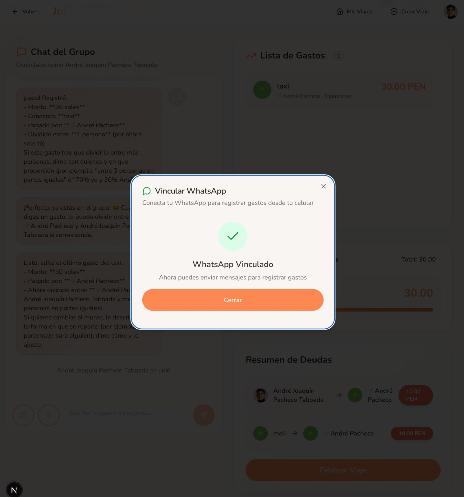

# JOURNI 🌍✨


> **Viajar con amigos no debería terminar en hojas de cálculo interminables.**
> JOURNI convierte el caos de los gastos grupales en **transparencia total**, mientras captura cada momento especial del viaje.

<div align="center">
  <video src="./public/assets/demo/demo-uso.mp4" controls width="100%"></video>
  <p><em>Demo en vivo: Dos usuarios interactuando en tiempo real en la plataforma web</em></p>
</div>

---

## 🎯 El Problema

Organizar un viaje grupal hoy significa:

- 📊 **Hojas de cálculo infinitas**: "¿Quién pagó el taxi? ¿Dividimos el almuerzo?"
- 💸 **Cuentas confusas**: "Creo que me debes... ¿o te debo yo?"
- 📱 **Apps fragmentadas**: WhatsApp para fotos, Excel para gastos, Google Maps para ubicaciones
- 😰 **Estrés al final del viaje**: "Dame 3 días para calcular quién debe a quién"

**El resultado:** Amistades tensas y recuerdos empañados por discusiones de dinero.

---

## ✨ La Solución: JOURNI

JOURNI es la **plataforma todo-en-uno** para viajes grupales que combina:

### 🧠 IA Conversacional para Gastos
Olvídate de formularios. Solo habla naturalmente:
- *"Pagué 50 soles del taxi"* → ✅ Gasto registrado
- *"Juan pagó 100 del almuerzo para todos"* → ✅ Automáticamente dividido
- *"¿Cuánto debo?"* → 💰 Balance instantáneo
- *"Edita el gasto del taxi a 60"* → ✏️ Corregido

<div align="center">
  <video src="./public/assets/demo/chatbot-wsp.mp4" controls width="100%"></video>
  <p><em>Chatbot en WhatsApp: Gestiona tus gastos desde donde estés</em></p>
</div>

### 📸 Álbum de Recuerdos Vivo
- Sube fotos mientras viajas
- Organízalas por **Momentos** (días, lugares, eventos)
- Etiqueta ubicaciones en el **mapa interactivo**
- Revive tu viaje en una línea de tiempo visual

### 💰 Cálculo Automático de Balances
- **Múltiples monedas**: PEN, CLP, USD, EUR, ARS, BRL, COP
- **Optimización de deudas**: Minimiza las transferencias necesarias
- **Transparencia total**: Todos ven lo mismo en tiempo real

### ⚡ Tiempo Real para Todos
- Chat grupal sincronizado
- Actualizaciones instantáneas de gastos
- Indicadores de presencia (quién está en línea)
- Sin recargas, sin confusiones

---

## 🚀 Características Principales

### 1. 🗣️ Asistente IA con 12 Herramientas Especializadas

Nuestro agente basado en **LangGraph** no solo entiende texto, sino que **actúa**:

**Gestión de Gastos:**
- ✅ Registrar gastos con lenguaje natural
- ✏️ Editar gastos existentes
- 🗑️ Eliminar gastos
- 📋 Listar todos los gastos del viaje

**Balances y Pagos:**
- 💵 Consultar balances individuales o grupales
- 🔄 Calcular liquidaciones optimizadas ("¿quién le paga a quién?")
- 💸 Registrar pagos entre usuarios (*"Le pagué 30 a Pedro"*)

**Fotos y Recuerdos:**
- 📷 Crear hitos/momentos del viaje
- 🖼️ Subir fotos a los momentos
- 🗺️ Etiquetar ubicaciones
- 👁️ Analizar fotos con visión artificial (GPT-4o)


*Ejemplo: Conversación natural para registrar gastos*

---

### 2. 📊 Dashboard Inteligente

**Tarjeta Hero del Viaje Activo:**
- Barra de progreso (día X de Y)
- Portada visual personalizada
- Acceso rápido al chat y funciones

**Estadísticas Rápidas:**
- 💰 Total gastado en el viaje
- 🔢 Tu balance (debes/te deben)
- 📸 Cantidad de fotos subidas
- 📍 Lugares visitados
- ⭐ Momentos creados

**Acciones Rápidas:**
- Agregar gasto
- Subir foto
- Ver mapa de recuerdos
- Compartir código del viaje


*Vista del dashboard con estadísticas del viaje*

---

### 3. 🗺️ Mapa Interactivo de Recuerdos

- **Marcadores de ubicaciones** visitadas
- **Visualización temporal** de tu ruta
- **Fotos geoetiquetadas** en cada lugar
- **Navegación fluida** entre momentos


*Visualiza tu viaje en un mapa interactivo*

---

### 4. 💬 Chat Grupal en Tiempo Real

**WebSocket Multiusuario:**
- Mensajes instantáneos para todos los participantes
- Respuestas de IA en streaming
- Indicadores de escritura
- Soporte para imágenes (recibos, fotos)

**Tipos de Mensajes:**
- 👤 Mensajes de usuarios
- 🤖 Respuestas del asistente IA
- 📥 Notificaciones de entrada/salida
- 🖼️ Imágenes compartidas (base64)

<div align="center">
  
  <p><em>Integración con WhatsApp para uso sin fricciones</em></p>
</div>

---

### 5. 🔗 Invitaciones Sin Fricción

- **Código de 6 caracteres** único por viaje
- **Modo invitado anónimo**: Únete sin crear cuenta
- **Compartir en un clic**: Link directo al viaje
- **Lista de participantes** con avatares


*Invita a tus amigos con un código simple*

---

### 6. 📈 Análisis de Gastos Avanzado

**Cálculo de Balances:**
```
Balance = Total Pagado - Parte Justa
• Balance negativo = Debes dinero
• Balance positivo = Te deben dinero
```

**Optimización de Deudas:**
- Separación por moneda
- Algoritmo greedy para minimizar transacciones
- Plan de pagos simplificado

**Visualizaciones:**
- Gráficos de torta con Recharts
- Desglose por persona
- Totales por moneda

---

## 🛠️ Stack Tecnológico

### Frontend
| Tecnología | Versión | Propósito |
|------------|---------|-----------|
| **Next.js** | 16.0.5 | Framework React con App Router |
| **React** | 19.2.0 | Biblioteca UI |
| **TypeScript** | 5.x | Desarrollo type-safe |
| **Tailwind CSS** | 3.4.17 | Estilos utility-first |
| **Framer Motion** | 12.23.24 | Animaciones fluidas |
| **Radix UI** | Latest | Componentes accesibles |
| **React Query** | 5.83.0 | Gestión de estado del servidor |
| **Supabase Client** | 2.86.0 | Cliente de base de datos y auth |
| **Recharts** | 2.15.4 | Visualización de datos |
| **XY Flow** | 12.9.3 | Gráficos interactivos |

### Backend
| Tecnología | Versión | Propósito |
|------------|---------|-----------|
| **Python** | 3.11+ | Lenguaje backend |
| **FastAPI** | Latest | Framework web async |
| **LangGraph** | Latest | Orquestación de agentes IA |
| **LangChain** | Latest | Integración con LLMs |
| **Uvicorn** | Latest | Servidor ASGI |
| **Pydantic** | Latest | Validación de datos |

### IA
- **GPT-4o** (Principal): Capacidades multimodales con visión
- **GPT-4o-mini** (Secundario): Fallback más rápido
- **Claude** (Terciario): Fallback alternativo
- **Gemini** (Cuaternario): Fallback adicional

### Infraestructura
- **Supabase**: Base de datos PostgreSQL, autenticación, almacenamiento
- **Railway**: Despliegue del backend
- **Vercel**: Hosting del frontend (recomendado)

---

## 📂 Estructura del Proyecto

```
my-app/
├── backend/                          # Backend FastAPI + Python
│   ├── main.py                      # Servidor con WebSocket y HTTP
│   ├── graph.py                     # Agente LangGraph con 12 herramientas IA
│   ├── room_manager.py              # Gestión de salas WebSocket
│   ├── services/
│   │   ├── supabase_db.py           # Persistencia de estado
│   │   ├── supabase_storage.py      # Almacenamiento de fotos
│   │   └── session_service.py       # Gestión de sesiones
│   └── requirements.txt             # Dependencias Python
│
├── src/                             # Frontend Next.js
│   ├── app/                         # App Router (Next.js 13+)
│   │   ├── page.tsx                 # Landing page
│   │   ├── auth/                    # Páginas de autenticación
│   │   ├── dashboard/               # Dashboard principal
│   │   ├── create-session/          # Crear viaje
│   │   ├── join/[code]/             # Unirse con código
│   │   ├── session/[id]/            # Chat y gastos del viaje
│   │   └── trip/[id]/               # Detalles y análisis
│   │
│   ├── components/
│   │   ├── chat/                    # Componentes de chat
│   │   │   ├── ChatConversation.tsx # Área de mensajes
│   │   │   ├── ChatInput.tsx        # Input con subida de imágenes
│   │   │   └── ChatMessage.tsx      # Mensaje individual
│   │   ├── TripExpenses.tsx         # Lista de gastos
│   │   ├── TripMemoryMap.tsx        # Mapa interactivo
│   │   ├── TripMoments.tsx          # Álbum de fotos
│   │   └── ui/                      # 50+ componentes Radix UI
│   │
│   ├── hooks/
│   │   └── useJourniChat.ts         # Hook de chat WebSocket
│   │
│   ├── contexts/
│   │   └── AuthContext.tsx          # Contexto de autenticación
│   │
│   └── assets/                      # Imágenes estáticas
│
├── supabase/
│   └── migrations/                  # 7 migraciones de BD
│       ├── 001_initial_schema.sql   # Esquema base
│       ├── 002_rls_policies.sql     # Seguridad Row-Level
│       └── ...                      # Más migraciones
│
└── Documentation/                   # Documentación completa
    ├── COMPREHENSIVE_DOCUMENTATION.md
    ├── DATABASE_SETUP_GUIDE.md
    └── ...
```

---

## 🗄️ Esquema de Base de Datos

### 8 Tablas Principales

1. **users** - Perfiles de usuario (extiende Supabase Auth)
2. **trips** - Metadata de viajes con códigos únicos
3. **trip_participants** - Participantes por viaje
4. **expenses** - Todos los gastos registrados
5. **expense_splits** - División de gastos
6. **chat_messages** - Historial del chat grupal
7. **photos** - Metadatos del álbum de fotos
8. **locations** - Lugares visitados para el mapa

### Seguridad
- ✅ **Row Level Security (RLS)** en todas las tablas
- ✅ Solo ves tus propios viajes
- ✅ Verificación automática de permisos
- ✅ 35 políticas de seguridad implementadas

### Características Automáticas
1. **División automática de gastos** entre participantes
2. **Timestamps automáticos** (created_at, updated_at)
3. **Cálculo de balances** con vista `user_trip_balances`
4. **Generador de códigos** con función `generate_session_code()`

---

## 🏁 Empezando

### Prerrequisitos
- Node.js 18+
- Python 3.11+
- Cuenta de Supabase
- API Key de OpenAI

### Instalación

#### 1. **Clonar el Repositorio**
```bash
git clone <tu-repositorio>
cd my-app
```

#### 2. **Configurar Variables de Entorno**

Crea `.env.local` en la raíz:
```env
# Supabase
NEXT_PUBLIC_SUPABASE_URL=tu_url_de_supabase
NEXT_PUBLIC_SUPABASE_ANON_KEY=tu_clave_anon

# OpenAI
OPENAI_API_KEY=tu_api_key_de_openai

# Backend (opcional para desarrollo local)
NEXT_PUBLIC_BACKEND_URL=http://localhost:8000
```

Crea `.env` en `/backend`:
```env
OPENAI_API_KEY=tu_api_key_de_openai
SUPABASE_URL=tu_url_de_supabase
SUPABASE_KEY=tu_service_role_key
```

#### 3. **Configurar Base de Datos**

1. Crea un proyecto en [Supabase](https://supabase.com)
2. Ejecuta las migraciones en orden:
   ```bash
   # En el SQL Editor de Supabase, ejecuta cada archivo en orden:
   # 001_initial_schema.sql
   # 002_rls_policies.sql
   # 003_views_and_functions.sql
   # 004_milestones_table.sql
   # 005_photos_milestone_link.sql
   # 006_anonymous_sessions.sql
   # 007_user_sync_trigger.sql
   ```
3. Configura autenticación por email en Supabase Authentication

<div align="center">
  
  <p><em>Configuración de autenticación en Supabase Dashboard</em></p>
</div>

#### 4. **Frontend - Instalación y Ejecución**
```bash
# Instalar dependencias
pnpm install

# Ejecutar servidor de desarrollo
pnpm dev

# Abrir http://localhost:3000
```

#### 5. **Backend - Instalación y Ejecución**
```bash
cd backend

# Crear entorno virtual
python -m venv .venv
source .venv/bin/activate  # En Windows: .venv\Scripts\activate

# Instalar dependencias
pip install -r requirements.txt

# Ejecutar servidor
python main.py

# Servidor corriendo en http://localhost:8000
```

---

## 📡 API Endpoints

### WebSocket (Tiempo Real)
```
ws://localhost:8000/ws/{thread_id}/{user_id}
```
Conexión de chat en tiempo real para mensajería multiusuario.

### HTTP

**Chat/Mensajes:**
```http
POST /api/chat
Content-Type: application/json

{
  "messages": [
    {"role": "user", "content": "Pagué 50 del taxi"}
  ],
  "id": "session-123"
}
```

**Estado de Sesión:**
```http
GET /api/sessions/{thread_id}
```
Obtiene estado completo (gastos, balances, participantes).

**Health Check:**
```http
GET /
```

---

## 🎨 Sistema de Diseño

### Paleta de Colores (Tema Viaje & Atardecer)

| Color | Hex | Uso |
|-------|-----|-----|
| **Coral Principal** | `#FF8750` | Botones, acciones primarias |
| **Verde Naturaleza** | `#B9E88A` | Badges, estados de éxito |
| **Azul Cielo** | `#BEE5FF` | Tema de viaje, calma |
| **Crema Cálido** | `#FFF7F0` | Fondos de tarjetas |
| **Verde Suave** | `#DDEFC4` | Fondo de la app |
| **Texto Oscuro** | `#2F2F3A` | Texto principal |

### Filosofía de Diseño
- ✨ Estética cálida e invitadora para viajes
- 😊 Comunicación visual basada en emojis
- 🎭 Animaciones suaves con Framer Motion
- 📱 Diseño mobile-first responsive
- ♿ Contraste accesible y tipografía clara

---

## 🚀 Despliegue

### Frontend (Vercel - Recomendado)
```bash
# Instalar Vercel CLI
pnpm i -g vercel

# Desplegar
vercel

# Variables de entorno a configurar en Vercel:
# - NEXT_PUBLIC_SUPABASE_URL
# - NEXT_PUBLIC_SUPABASE_ANON_KEY
# - NEXT_PUBLIC_BACKEND_URL (URL de Railway)
```

### Backend (Railway)
1. Crear nuevo proyecto en [Railway](https://railway.app)
2. Conectar repositorio GitHub
3. Configurar variables de entorno:
   - `OPENAI_API_KEY`
   - `SUPABASE_URL`
   - `SUPABASE_KEY`
4. Railway detecta automáticamente FastAPI con Nixpacks
5. Comando de inicio: `uvicorn main:app --host 0.0.0.0 --port $PORT`

---

## 🧪 Testing

### Backend
```bash
cd backend
pytest tests/test_graph.py -v
```

Pruebas incluidas:
- ✅ Registro de gastos
- ✅ Cálculo de balances
- ✅ Optimización de deudas
- ✅ Gestión de fotos
- ✅ Creación de momentos

---

## 🤝 Contribuir

Las contribuciones son bienvenidas. Por favor:

1. Fork el proyecto
2. Crea una rama para tu feature (`git checkout -b feature/AmazingFeature`)
3. Commit tus cambios (`git commit -m 'Add some AmazingFeature'`)
4. Push a la rama (`git push origin feature/AmazingFeature`)
5. Abre un Pull Request

---

## 📄 Licencia

Este proyecto es privado y está en desarrollo activo.

---

## 👥 Equipo

Desarrollado con ❤️ para el Hackathon AI Perú 2025

---

## 🔗 Links Útiles

- [Documentación de Next.js](https://nextjs.org/docs)
- [Documentación de Supabase](https://supabase.com/docs)
- [LangGraph Documentation](https://python.langchain.com/docs/langgraph)
- [FastAPI Documentation](https://fastapi.tiangolo.com/)

---

<div align="center">
  <strong>¿Listo para viajar sin estrés financiero?</strong><br>
  <em>Únete a JOURNI y transforma tus viajes grupales</em>
</div>
